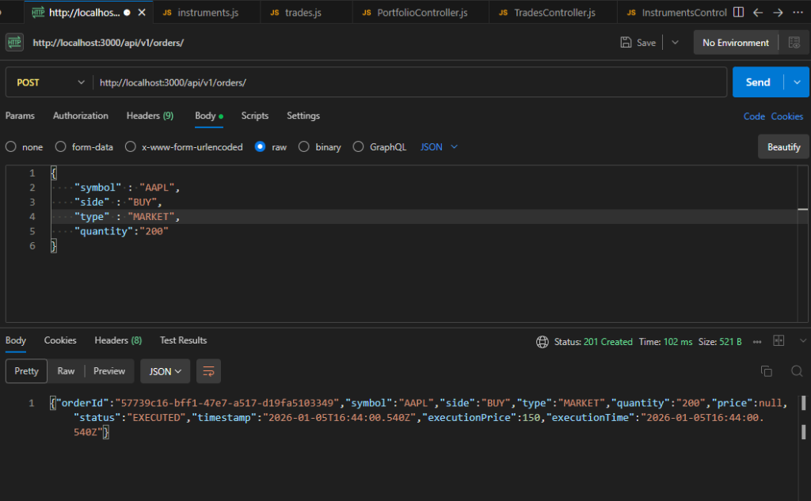
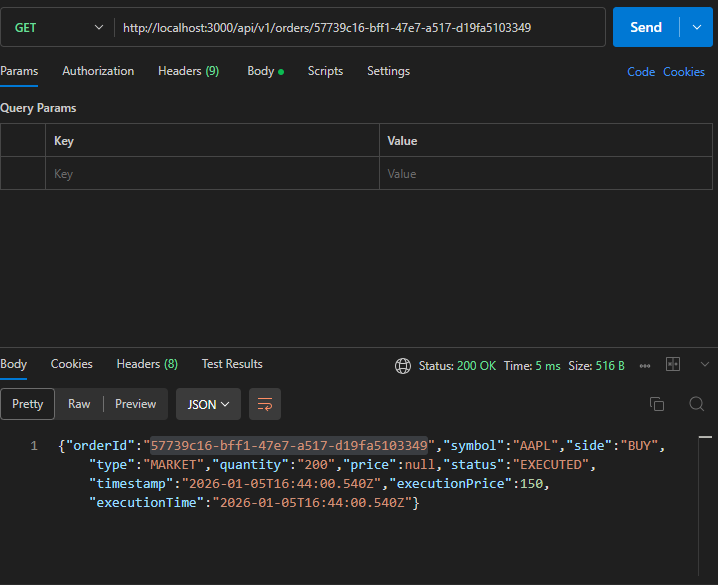
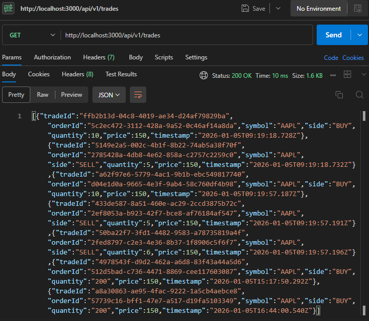
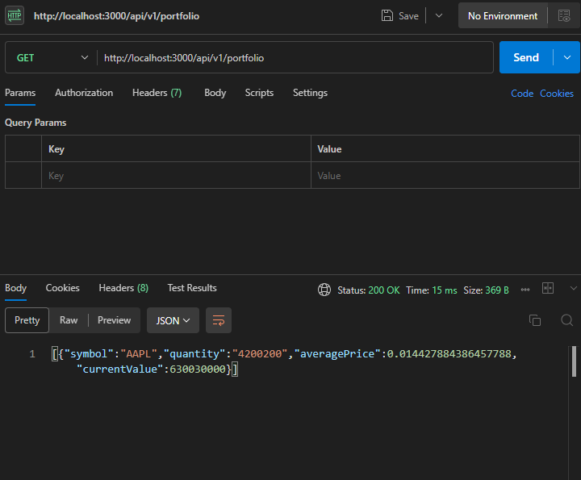

# Trading System Wrapper SDK & Backend

A simplified trading backend with a wrapper SDK, simulating core trading workflows like order placement, execution, and portfolio management.

## Features

- **REST API Backend** (Node.js/Express)
    - In-Memory Database for high-speed simulation.
    - APIs for Instruments, Orders, Trades, and Portfolio.
    - Swagger/OpenAPI Documentation.
    - JSON Logging with `winston`.
- **Trading SDK** (Node.js)
    - Wrapper class `TradingSDK` for easy API interaction.
    - Built-in error handling.

## functional Requirements Implemented

1.  **View Instruments**: Fetch real-time (simulated) list of tradable assets.
2.  **Order Management**: Place BUY/SELL orders (MARKET/LIMIT).
    - *Simulation Logic*: Market orders execute immediately. Limit orders execute if price conditions are met against Last Traded Price (LTP).
3.  **Order Status**: Track order lifecycle (NEW -> EXECUTED).
4.  **Trades**: View history of executed trades.
5.  **Portfolio**: Real-time view of holdings and current valuation.

## Project Structure

- `backend/`: Express server code.
    - `src/controllers`: API logic.
    - `src/db`: In-Memory database.
    - `src/routes`: Route definitions.
- `sdk/`: SDK library code.
    - `TradingSDK.js`: Main client class.

## Setup & Running

### Prerequisites
- Node.js (v14+)
- npm

### 1. Start the Backend

```bash
cd backend
npm install
node src/index.js
```

The server will start on `http://localhost:3000`.
**Swagger Documentation**: [http://localhost:3000/api-docs](http://localhost:3000/api-docs)

### 2. Run the Verification Script (SDK Demo)

Open a new terminal:

```bash
cd sdk
npm install
node verify_flow.js
```

This script demonstrates the full flow: fetching instruments, placing orders, and checking portfolio updates.

## API Usage

### Instruments
`GET /api/v1/instruments`
Returns a list of available instruments with their current LTP.

### Orders
`POST /api/v1/orders`
- **Body**: `{ "symbol": "AAPL", "side": "BUY", "type": "MARKET", "quantity": 10 }`
- **Validation**: Quantity > 0. Price required for LIMIT orders.
- **Limit Order Logic**:
    - BUY: Executes if Limit Price >= LTP.
    - SELL: Executes if Limit Price <= LTP.





`GET /api/v1/orders/{orderId}`
Fetch the status of a specific order.

### Trades & Portfolio
`GET /api/v1/trades` - List all executed trades.



`GET /api/v1/portfolio` - List current holdings with average price and current value.



## Error Handling & Logging

- **Centralized Error Handling**: The backend catches errors and returns appropriate HTTP status codes (400 for bad input, 404 for not found, 500 for server errors).
- **Logging**: All requests and errors are logged using `winston` to the console (and optionally files).
- **Edge Cases**:
    - Invalid symbols or Order IDs return 404.
    - Negative quantity or missing fields return 400.
    - Network errors in SDK are wrapped with descriptive messages.

## SDK Example

```javascript
const { TradingSDK } = require('./sdk');
const sdk = new TradingSDK({ baseUrl: 'http://localhost:3000/api/v1' });

// Get Instruments
const instruments = await sdk.getInstruments();

// Place Order
const order = await sdk.placeOrder({
    symbol: 'AAPL',
    side: 'BUY',
    type: 'MARKET',
    quantity: 5
});

// Check Portfolio
const portfolio = await sdk.getPortfolio();
```
